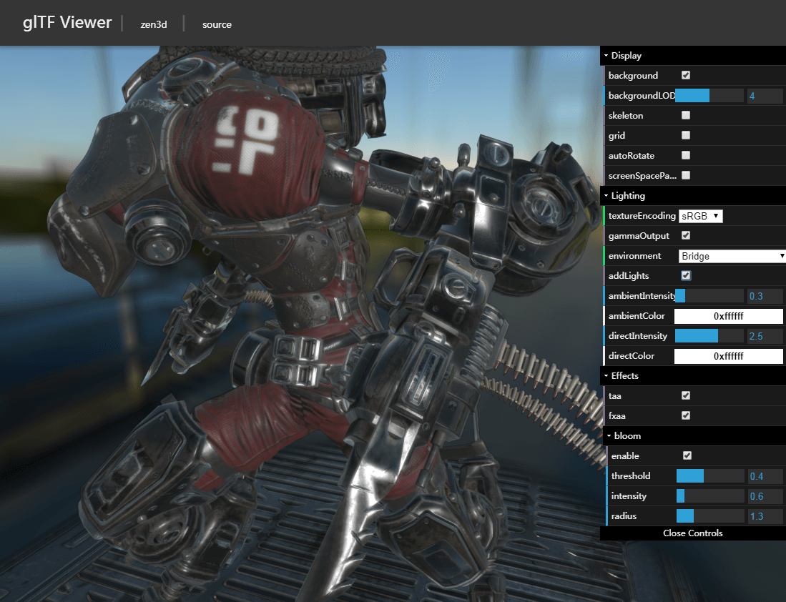
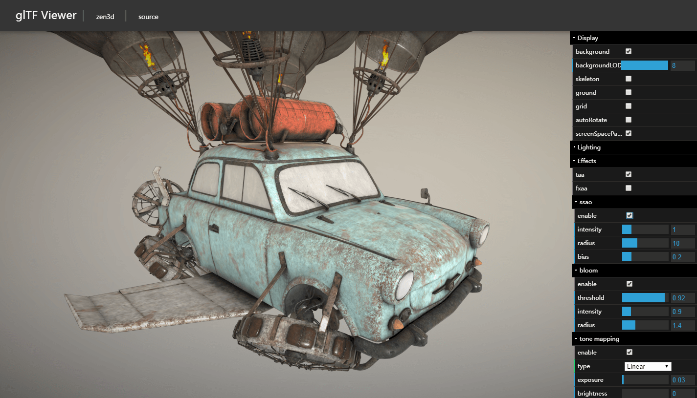

zen-viewer
==============

Preview glTF 2.0 models in WebGL using [zen3d](https://github.com/shawn0326/zen-3d) and a drag-and-drop interface.

Inspired by [three-gltf-viewer](https://github.com/donmccurdy/three-gltf-viewer).

You can get some test models from [sketchfab](sketchfab.com) or [glTF-Sample-Models](https://github.com/KhronosGroup/glTF-Sample-Models).

[Online Zen Viewer](https://shawn0326.github.io/zen-viewer/)

### About Me ###

* Blog: [Half Lab](http://www.halflab.me)
* Email: shawn0326@163.com
* Weibo: [@谢帅shawn](http://weibo.com/shawn0326)